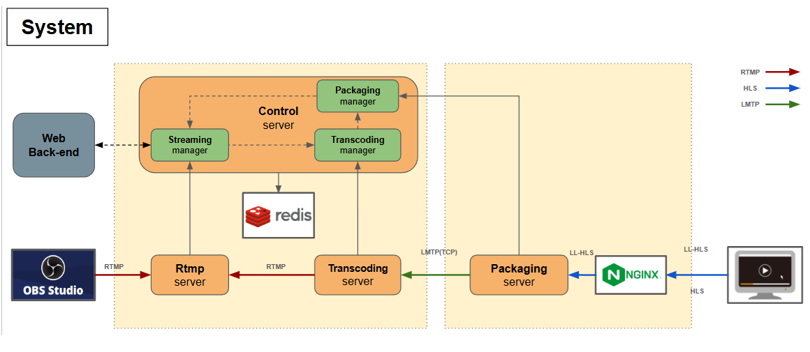

# System


# RtmpServer

Streaming System RTMP Server

- rtmp
- c++20
- docker/windows/ubuntu

## Docker

- Build

  ```sh
  docker build -t rtmp-server:latest .
  ```

- Exec
  ```sh
  docker run --rm --network test --name rtmp-server -p 1935:1935 -p 7775:7775 -e CONTROLLER_HOST=host.docker.internal rtmp-server:latest
  ```
- Test
  - 송출 URL : `rtmp://127.0.0.1:1935/live/test`
  - 시청 URL : `rtmp://127.0.0.1:7775/live/test`

## Windows Build

- Boost

  - 다운로드 (1.85.0) 및 실행: [Boost 다운로드](https://sourceforge.net/projects/boost/files/boost-binaries/1.85.0/boost_1_85_0-msvc-14.3-64.exe/download)

- Hiredis

  ```sh
  git clone https://github.com/redis/hiredis.git
  cd hiredis
  mkdir build
  cd build
  cmake -DBUILD_SHARED_LIBS=OFF ..
  cmake --build . --config Release
  ```

  - external/redis 하위 폴더에 header와 lib 복사

- CMake Build
  ```sh
  cmake.exe --no-warn-unused-cli -DCMAKE_EXPORT_COMPILE_COMMANDS=TRUE -S . -B ./build -G "Visual Studio 17 2022" -T host=x64 -A x64
  cmake.exe --build ./build --config Debug --target ALL_BUILD -j 26
  ```

## Ubuntu (22) Build

- C++20/dev/Boost Install
  ```sh
  sudo apt update
  sudo apt install gcc g++
  gcc --version && g++ --version
  sudo apt install cmake
  cmake --version && make --version
  sudo apt install build-essential python3-dev autotools-dev libicu-dev libbz2-dev -y
  wget https://boostorg.jfrog.io/artifactory/main/release/1.85.0/source/boost_1_85_0.tar.gz
  tar -zxvf boost_1_85_0.tar.gz
  cd boost_1_85_0/
  sudo ./bootstrap.sh --prefix=/usr/
  sudo ./b2
  sudo ./b2 install
  wget https://github.com/Kitware/CMake/releases/download/v3.28.0/cmake-3.28.0.tar.gz
  tar -zxvf cmake-3.28.0.tar.gz
  cd cmake-3.28.0
  ./bootstrap
  make
  sudo make install
  ```
- Build
  ```sh
  mkdir build
  cd build
  cmake ..
  make
  cd src/rtmp_server/
  ./rtmp_server
  ```

## OBS Setting

- 설정 -> 방송 -> 서버 -> `rtmp://127.0.0.1:1935/live`
- 설정 -> 방송 -> 스트림키 -> `test`
- 설정 -> 출력 -> 출력방식 -> 고급 선택
- 설정 -> 출력 -> 키프레임 간격 -> 1S
- 설정 -> 출력 -> 프로파일 -> baseline
